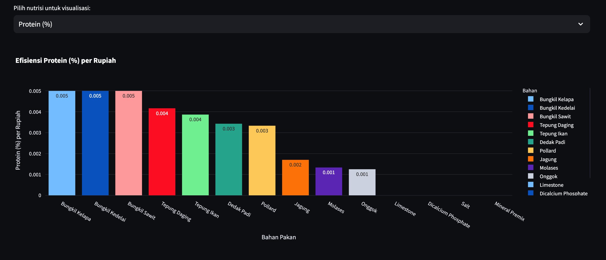

# Kalkulator Efisiensi Pakan (Feed Efficiency Calculator)

## Deskripsi
Aplikasi Streamlit untuk menghitung efisiensi ekonomis bahan pakan berdasarkan kandungan nutrisi dan harga. Aplikasi ini juga menyediakan alat optimasi formulasi ransum untuk mendapatkan kombinasi bahan pakan yang memenuhi kebutuhan nutrisi dengan biaya minimum.

## Video Demonstrasi


[▶️ Tonton Video Demonstrasi](./video.mov)

## Fitur
- **Perhitungan Efisiensi**: Menghitung rasio nutrisi per biaya untuk berbagai bahan pakan
- **Visualisasi Data**: Grafik interaktif untuk memvisualisasikan metrik efisiensi
- **Optimasi Formulasi Pakan**: Mengoptimalkan formulasi pakan menggunakan Linear Programming untuk meminimalkan biaya
- **Auto-optimasi**: Menguji berbagai kombinasi target nutrisi untuk menemukan formulasi paling ekonomis
- **Batasan Kustom**: Mengatur batas minimum dan maksimum penggunaan untuk setiap bahan pakan
- **Pengelolaan Mineral**: Menetapkan target untuk mineral makro dan mikro
- **Import/Export Data**: Mengunggah data kustom atau menggunakan data contoh, dan mengunduh hasil

## Instalasi

### Prasyarat
- Python 3.7+
- pip

### Pemasangan
1. Clone repositori ini:
   ```
   git clone https://github.com/yourusername/ransum.git
   cd ransum
   ```

2. Pasang paket yang diperlukan:
   ```
   pip install -r requirements.txt
   ```

## Penggunaan
1. Jalankan aplikasi:
   ```
   streamlit run BahanPakan.py
   ```

2. Buka browser web dan navigasi ke URL yang ditampilkan di terminal (biasanya http://localhost:8501)

3. Cara menggunakan aplikasi:
   - Unggah data bahan pakan Anda atau gunakan data contoh
   - Lihat perhitungan dan visualisasi efisiensi
   - Atur target nutrisi untuk nutrisi utama dan mineral
   - Konfigurasikan batasan penggunaan bahan
   - Jalankan optimasi
   - Lihat dan unduh hasil formulasi yang dioptimalkan

## Format Data
Aplikasi ini membutuhkan file CSV dengan kolom berikut:
- `Bahan`: Nama bahan pakan
- `Protein (%)`: Persentase kandungan protein
- `Lemak (%)`: Persentase kandungan lemak
- `Serat (%)`: Persentase kandungan serat
- `ME (Kcal/kg)`: Energi metabolisme
- `Kalsium (%)`: Persentase kandungan kalsium
- `Fosfor (%)`: Persentase kandungan fosfor
- `Sodium (%)`: Persentase kandungan sodium
- `Magnesium (%)`: Persentase kandungan magnesium
- `Besi (mg/kg)`: Kandungan besi dalam mg/kg
- `Zinc (mg/kg)`: Kandungan zinc dalam mg/kg
- `Copper (mg/kg)`: Kandungan tembaga dalam mg/kg
- `Mangan (mg/kg)`: Kandungan mangan dalam mg/kg
- `Selenium (mg/kg)`: Kandungan selenium dalam mg/kg
- `Harga (Rp/kg)`: Harga dalam Rupiah per kg

Anda dapat mengunduh template dari aplikasi.

## Metode Optimasi
Aplikasi ini menggunakan Linear Programming untuk mencari kombinasi optimal bahan pakan yang:

1. Memenuhi atau melampaui kebutuhan nutrisi minimum
2. Meminimalkan total biaya pakan
3. Memperhatikan batasan penggunaan minimum dan maksimum untuk setiap bahan

Formulasi matematis:
- Minimumkan: ∑(Harga_i × Proporsi_i)
- Dengan syarat:
  - ∑(Nutrisi_i,j × Proporsi_i) ≥ Target_j untuk setiap nutrisi j
  - Min_i ≤ Proporsi_i ≤ Max_i untuk setiap bahan i
  - ∑Proporsi_i = 1 (jumlah semua proporsi sama dengan 100%)

## Fitur Lanjutan
- **Auto-optimasi**: Aplikasi dapat otomatis menguji berbagai kombinasi target protein dan energi untuk menemukan formulasi dengan biaya paling efektif
- **Metrik Optimasi**: Pilih antara berbagai tujuan optimasi (biaya terendah, rasio protein/biaya terbaik, rasio energi/biaya terbaik, atau seimbang)
- **Batasan Penggunaan**: Atur persentase minimum dan maksimum untuk setiap bahan pakan dalam formulasi
- **Visualisasi**: Lihat diagram pie yang menunjukkan komposisi pakan yang dioptimalkan dan diagram batang yang menunjukkan kontribusi nutrisi oleh bahan

## Data Contoh
Aplikasi ini menyertakan data contoh untuk bahan pakan umum termasuk:
- Biji-bijian dasar (jagung, dedak padi, pollard gandum)
- Sumber protein (bungkil kedelai, tepung ikan, tepung daging)
- Produk sampingan (bungkil kelapa, bungkil sawit, molases)
- Sumber mineral (limestone, dicalcium phosphate, garam, premix mineral)

## Lisensi
Developed by Galuh Adi Insani